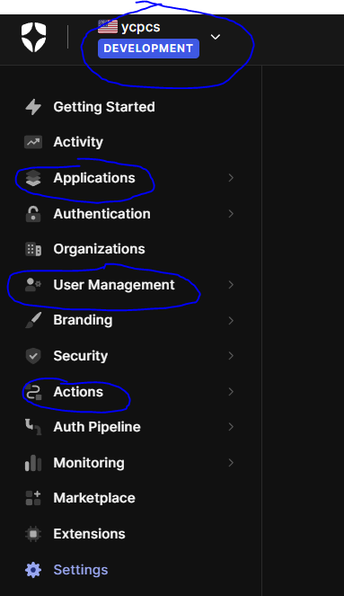
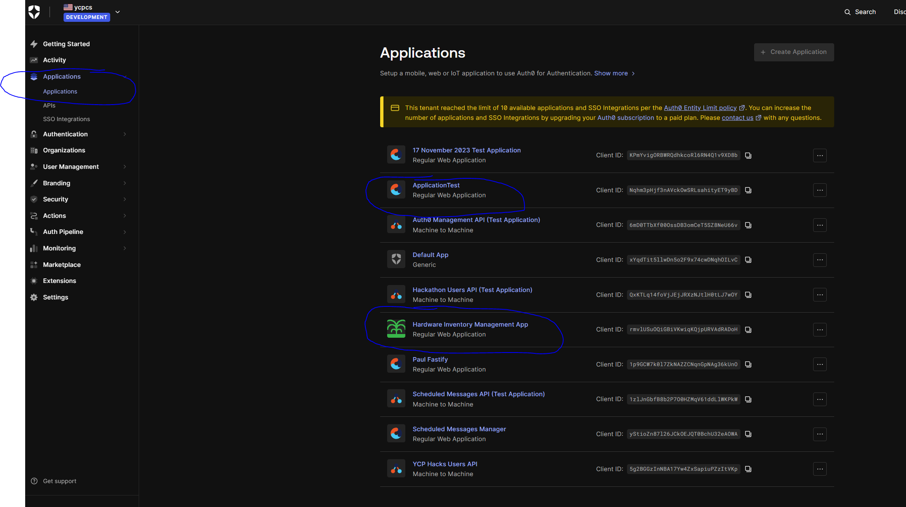
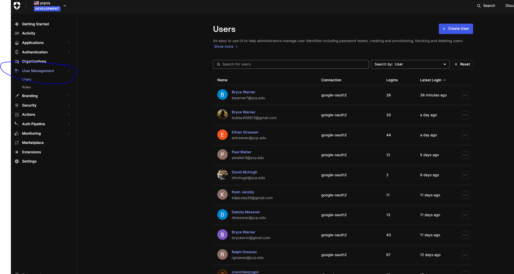
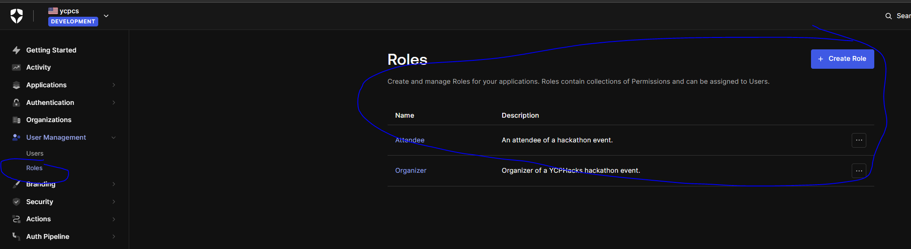
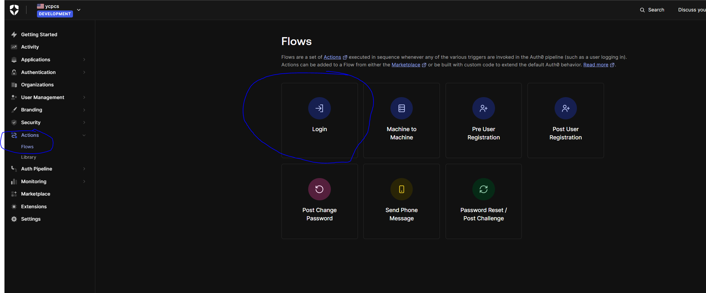
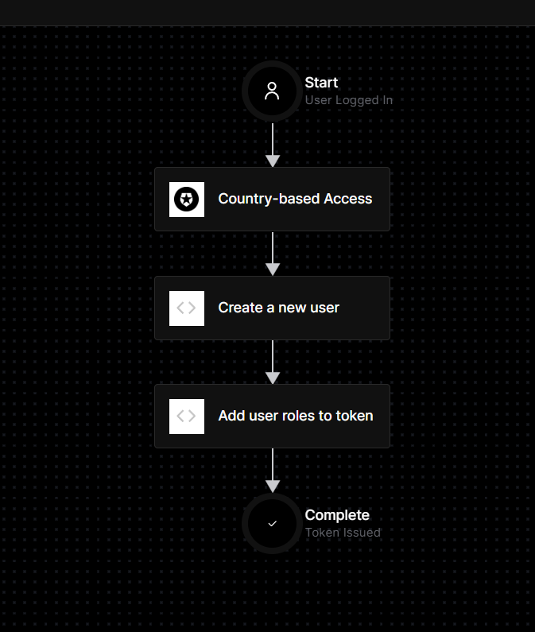

+++
title = 'Auth0'
date = 2024-02-28T00:45:03-05:00
disableToc=true
+++
# Auth0

Make sure to request access from either a current member or from a member from the previous team

Make sure that at the top left, it says "ycpcs DEVELOPMENT" so you know you're in the right area. 

The other circled tabs are the most important tabs you will be using. 

# Applications

Applications holds the setup for each individual application we have. There are a lot of test applications in there from the previous team trying to figure out how it works. The application with the YCP logo is the one currently being used by the hardware management system.

# USER

This is where you can see all the users who have access and also what roles they have. 

Roles allow for role based views such as only organizers being able to check out items (For the time being).

# Actions

Actions create and view different workflows set up. Currently we have a login workflow that allows users to login via different modes. 

