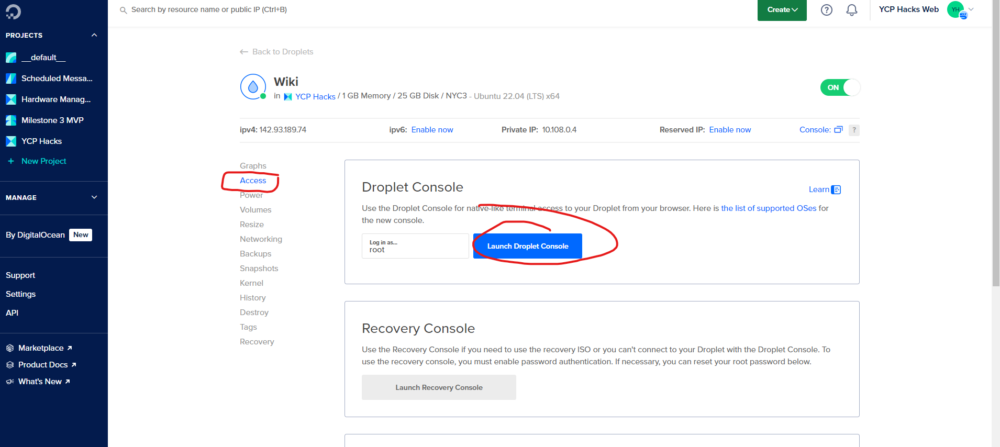

+++
title = 'D'
date = 2024-02-28T00:45:03-05:00
disableToc=true
+++
# Docker

Make sure you have Docker Desktop installed on your computer,

If not go to this link and install:


https://www.docker.com/products/docker-desktop/


Open github you want to dockerize in your text editor of choice,
We will be using Webstorm for this example:


# Make dockerfile
The easiest way is to go to ChatGPT and ask it to make a Dockerfile.
It will look something like this.

"Dockerfile"
```
# Use an official Node.js runtime as the base image
FROM node:latest

# Set the working directory in the container
WORKDIR /app

# Copy package.json and package-lock.json to the working directory
COPY package*.json ./

# Install dependencies
RUN npm install

# Copy the rest of the application code to the working directory
COPY . .

# Expose the port the app runs on
EXPOSE 3000

# Command to run the application
CMD ["npm", "run", "start"]
```
You may have to change the port if another program is being run on 3000


# Make yml
Same as the Dockerfile, just ask ChatGPT to make you a 
docker-compose.yml file based on the first prompt.  

"docker-compose.yml"
```
version: '3'

services:
  wiki:
    build:
      context: .
      dockerfile: Dockerfile
    image: ycphacks/wiki
    container_name: wiki
    ports:
      - "1313:1313"
```
This is an example of what it could look like, the port will have to match the port used 
in the Dockerfile. Instead of /wiki or wiki, change this name to something more descriptive
of your program with the requirement that it is one 
word and all lowercase (This is a docker requirement)

# Pushing
Make sure that Docker Desktop is running when trying to push your code

Log into docker desktop and docker on your web browser. The YCPHacks account 
is on a document given to you by the previous team.

Open the terminal and run
```
docker compose build .
```


In docker-desktop we should be able to see an Image of your program by going into 
Images/local. This step is to make sure your two new files worked properly 
and successfully made the image.

Now go to docker on your web browser and create a new repository with the name you decided on when you created the yml.


Here we can see the repo is named ycphacks/wiki which is exactly what we have in the yml above. 
You can also see on the right where it gives you the command to push to this newly made repo. You can copy that line into your terminal minus the tagname section since we will not be using tags

```
docker push REPONAME
```

You can refresh your web browser, and you should now see that your repo contains that same image found on docker desktop

# Digital Ocean
Go to Digital Ocean now to host your now container 

Go inside the droplet 

Enter the access tab and open a new root console


We need to make a new directory to contain the application.

To do this we will use 
```
mkdir DIRECTORY_NAME
cd DIRECTORY_NAME
```
It would be recommended to keep your naming conventions the same to the name of the repo you made earlier

Next we must add a docker-compose.yml file to this directory 
to tell it which container to pull. It will be exactly the same
as the previous yml file except it will not contain the build section
```
version: '3'

services:
  wiki:
    image: ycphacks/wiki
    container_name: wiki
    ports:
      - "1313:1313"
```

Now you should be able to run this command and your application should now be hosted on our droplet using Docker!
```
docker compose up -d
```
You can test it by going to the droplets IP address / whatever port your program is running on.
# Note
Our droplet currently has a firewall, so you must be sure to enable access to that port.


Make sure to scroll up to the inbound section as it initially opens this tab in the outbound section.