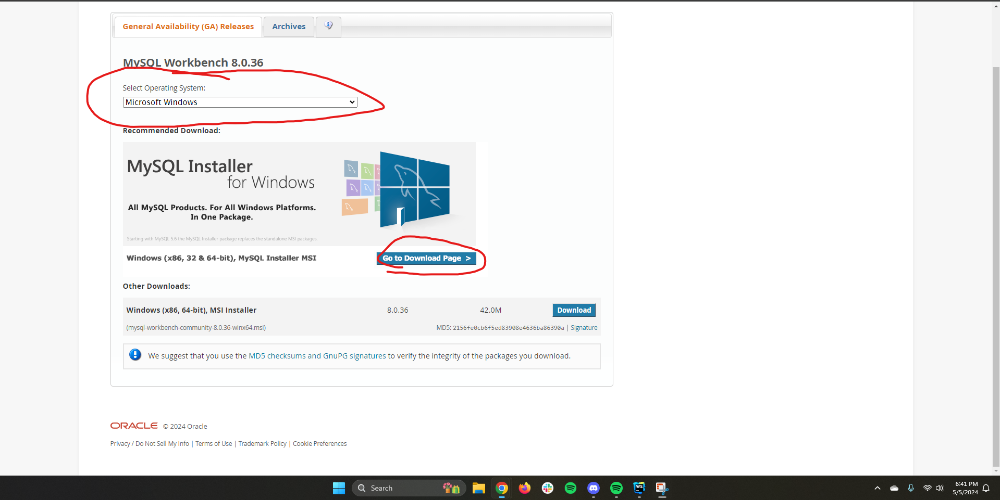
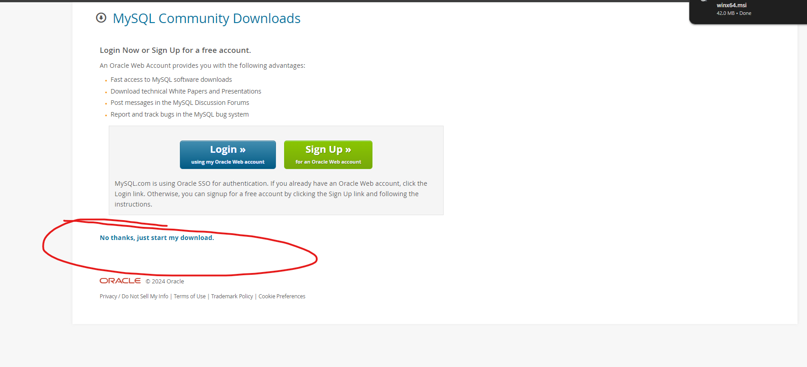
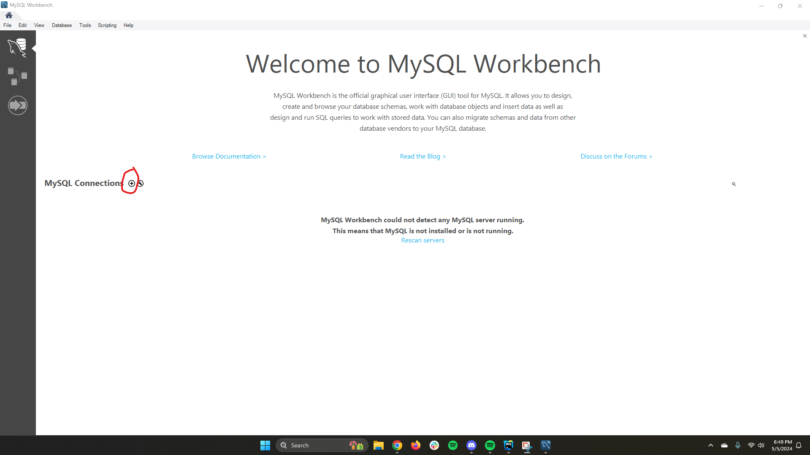
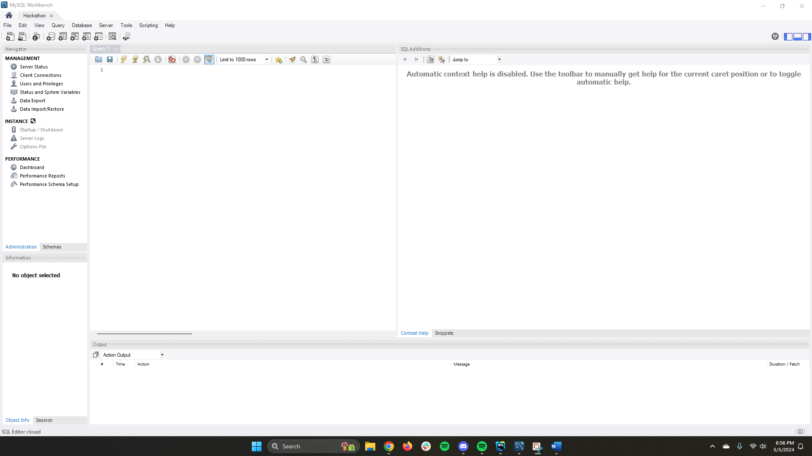
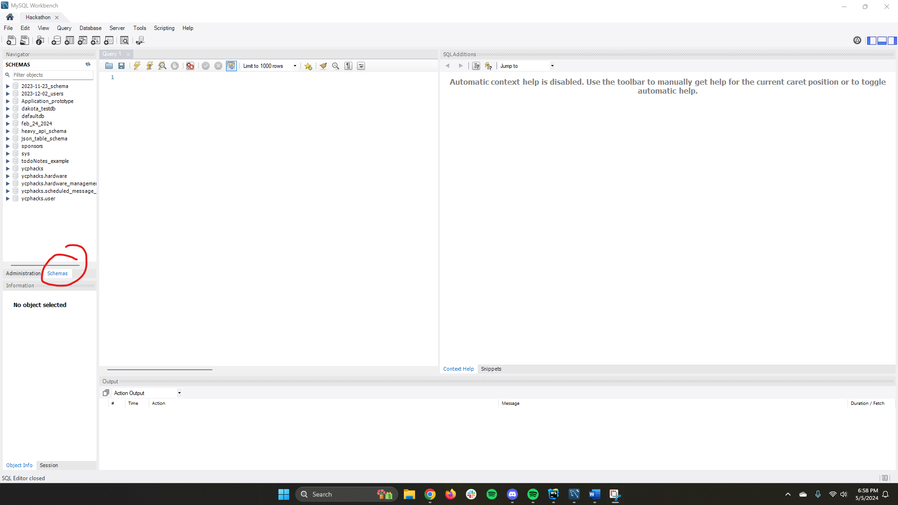

+++
title = 'MySQL'
date = 2024-02-28T00:45:03-05:00
disableToc=true
+++
# MySQL

Go to this link and Install MySQL Workbench
https://dev.mysql.com/downloads/workbench/

Make sure to select the correct operating system and install the correct version for your system.

On this page, select the "No thank you, continue my download" option.

No special customizations are required for the installation wizard so just click next through it until it is done.

After the installation is done you will be greeted with this page. Next to "MySQL Connections", there is a little plus sign (+) we will use to add the connection to our database.

Fill in the required information found on the "YCPHACKS Passwords and Connections" document left from the previous team.

After connecting to the database you should be met with this screen.

Hitting the "Schemas" button on the middle left will allow you to view all of the schemas used in the website.