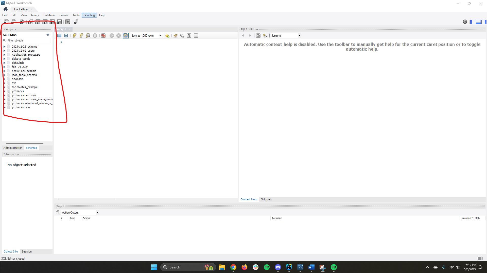

+++
title = 'Schemas'
date = 2024-02-28T00:45:03-05:00
disableToc=true
+++
# Schemas

On the left side of the screen, you can see all of the schemas currently in our database. 

If you would like to create a new schema, simply right click on an empty space in the schema's column and select "Create Schema..."

If you click into one of these schemas, the two most important things you will find are Tables and Stored Procedures. 

# Tables
Tables are just like any normal table you'd find in a database.

To make a new table, right-click "Tables" and select "Create Table..."

To edit or view an already made table, hover over the desired table and 3 faint buttons will appear on the right. select the wrench to edit the table and select the table with a lightning bolt to view the table and its contents. 

# Stored Procedures
To make a new stored procedures, right-click "Stored Procedures" and select "Create stored procedures"

To edit an already made Stored Procedure, right-click it and select "Alter Stored Procedure...
"