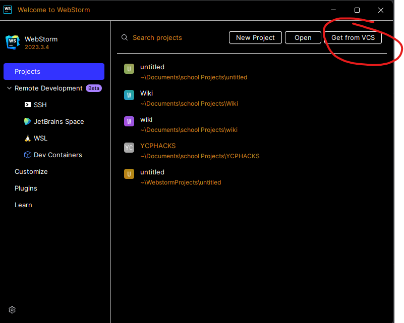
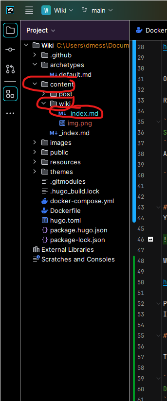
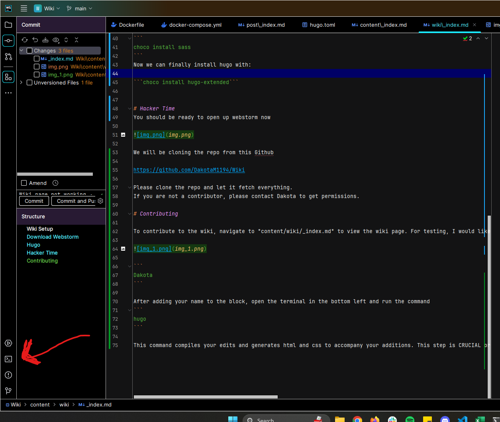

+++
title = 'Wiki'
date = 2024-02-28T00:45:03-05:00
disableToc=true
+++
# Wiki Setup 

This is a guide to contribute to the Wiki

# Download Webstorm
Webstorm is a JetBrains licenced IDE that is being used to add to the Wiki

Download and install here for Windows/Mac/Linux (Make sure to select the correct version above the download) 

https://www.jetbrains.com/webstorm/download/#section=windows

# Hugo
Hugo is a web-development tool that is great for making quick websites with prebuilt templates

If you would like to follow the exact directions to install feel free to go here 

https://gohugo.io/installation/windows/

Otherwise follow these instructions:

Go here and install GO

https://go.dev/doc/install


Open a Command Prompt as an Administrator.

Run this command to install chocolatey if you do not have it already 

```
Set-ExecutionPolicy Bypass -Scope Process -Force; [System.Net.ServicePointManager]::SecurityProtocol = [System.Net.ServicePointManager]::SecurityProtocol -bor 3072; iex ((New-Object System.Net.WebClient).DownloadString('https://community.chocolatey.org/install.ps1'))
```
After chocolatey is installed please run this command in the same terminal to install SASS

```
choco install sass
```
Now we can finally install hugo with:

```choco install hugo-extended```


# Hacker Time
You should be ready to open up webstorm now



We will be cloning the repo from this Github

https://github.com/DakotaM1194/Wiki

Please clone the repo and let it fetch everything.
If you are not a contributor, please contact Dakota to get permissions.

# Contributing

To contribute to the wiki, navigate to "content/wiki/_index.md" to view the wiki page. For testing, I would like everybody on the team to put their names into this code block to prove they are able to edit the wiki.



```
Dakota
Bryce
```

After adding your name to the block, open the Webstorm terminal in the bottom left and run the command 

```
hugo
```

This command compiles your edits and generates html and css to accompany your additions. This step is CRUCIAL or else your edits will not appear when you commit.

Finally, on the left, hit the commit tab and push all of your changes. A pop up will appear telling there are errors, we are programmers and don't write errors so push it anyway.

test :(