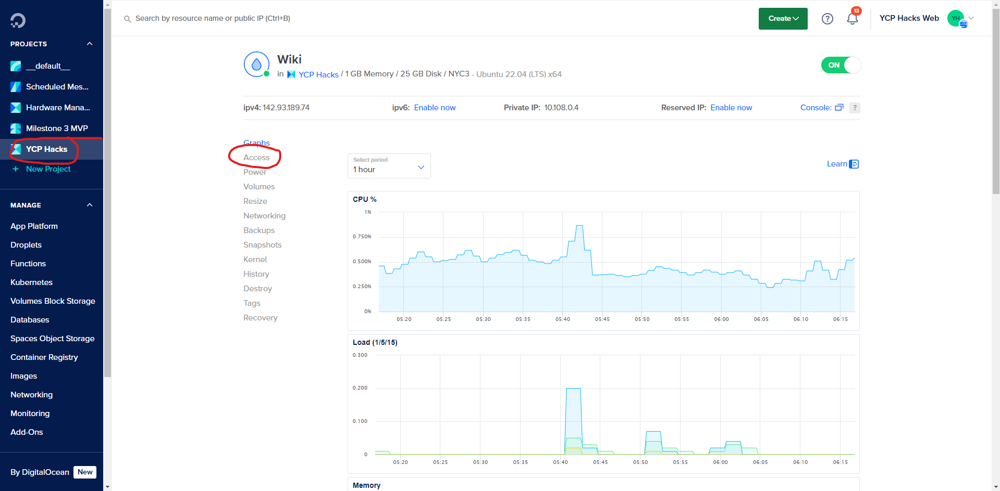
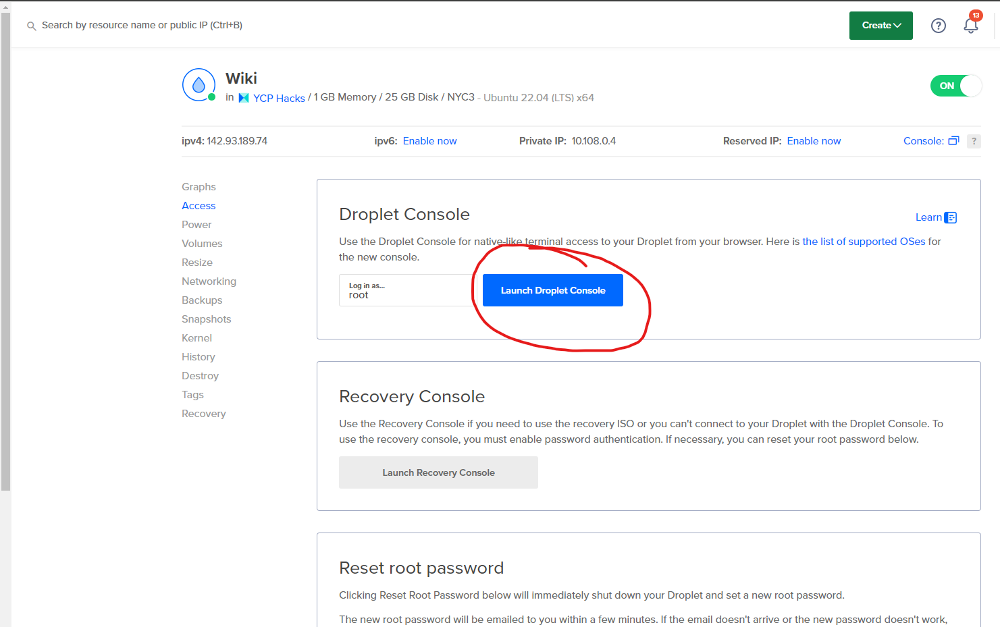

+++
title = 'Wiki Commits'
date = 2024-02-28T00:45:03-05:00
disableToc=true
+++

# Wiki Commiting
CI/CD does not appear to be working as intended on Github yet so all updates to the docker/server must be done manually

Visit the Wiki page on Digital Ocean to get started


Click on Access on the left side of the page


Launch the Droplet Console. Make sure not to launch the recovery console as that is a completely seperate console that might not work as intended

When the console launches, we are in the base directory and must cd into the wiki part of the server.

```
cd wiki
```

Afterwords the commands are very simple:
```
docker compose down
```
This shuts down the server and closes the website all together
```
docker compose pull
```
This pulls all the information from the docker website. Currently when someone commits to Github it will automatically push the whole repository to docker so any action to push to docker is unnecessary

Finally run
```
docker compose up -d
```
This starts up the server again with the newly grabbed changes from docker. '-d' just allows the server to disconnect from the terminal, so you may now close the terminal and your changes should be made to the wiki.

